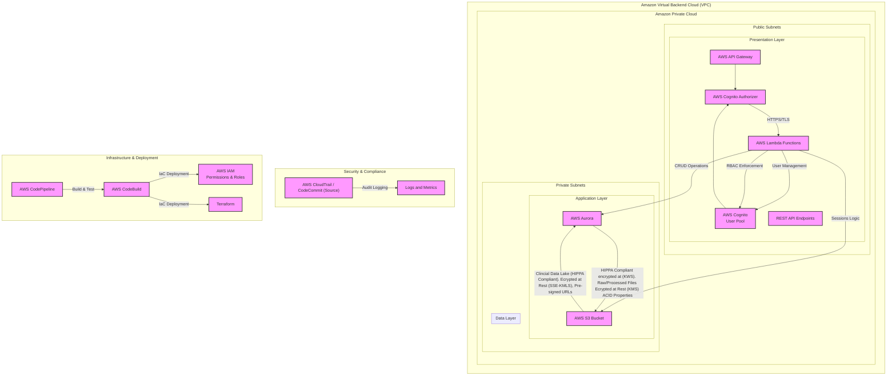

```mermaid
flowchart TD
  %% Top-level VPC
  subgraph VPC["Amazon Virtual Backend Cloud (VPC)"]
    subgraph PrivateCloud["Amazon Private Cloud"]
      subgraph PublicSubnets["Public Subnets"]
        subgraph PresentationLayer["Presentation Layer"]
          APIGateway["AWS API Gateway"]
          REST["REST API Endpoints"]
          CognitoAuthorizer["AWS Cognito Authorizer"]
          CognitoPool["AWS Cognito<br/>User Pool"]
          APIGateway --> CognitoAuthorizer
          CognitoPool --> CognitoAuthorizer
          CognitoAuthorizer -->|"HTTPS/TLS"| LambdaFunctions
        end
      end

      subgraph PrivateSubnets["Private Subnets"]
        subgraph ApplicationLayer["Application Layer"]
          LambdaFunctions["AWS Lambda Functions"]
          LambdaFunctions -->|"User Management"| CognitoPool
          LambdaFunctions -->|"CRUD Operations"| AuroraDB
          LambdaFunctions -->|"Sessions Logic"| S3Bucket
          LambdaFunctions -->|"RBAC Enforcement"| CognitoPool
        end

        subgraph DataLayer["Data Layer"]
          AuroraDB["AWS Aurora"]
          S3Bucket["AWS S3 Bucket"]
          AuroraDB -->|"HIPPA Compliant encrypted at (KWS). Raw/Processed Files Ecrypted at Rest (KMS) ACID Properties"| S3Bucket 
          S3Bucket -->|"Clincial Data Lake (HIPPA Compliant). Ecrypted at Rest (SSE-KMLS), Pre-signed URLs"| AuroraDB
        end
      end
    end
  end

  %% Security & Compliance
  subgraph Security["Security & Compliance"]
    CloudTrail["AWS CloudTrail / CodeCommit (Source)"]
    LogsMetrics["Logs and Metrics"]
    CloudTrail -->|"Audit Logging"| LogsMetrics
  end

  %% Infrastructure & Deployment
  subgraph Infra["Infrastructure & Deployment"]
    CodePipeline["AWS CodePipeline"]
    CodeBuild["AWS CodeBuild"]
    IAM["AWS IAM<br/>Permissions & Roles"]
    Terraform["Terraform"]
    CodePipeline -->|"Build & Test"| CodeBuild
    CodeBuild -->|"IaC Deployment"| IAM
    CodeBuild -->|"IaC Deployment"| Terraform
  end

  %% Styles
  style APIGateway fill:#f9f,stroke:#333,stroke-width:2px
  style REST fill:#f9f,stroke:#333,stroke-width:2px
  style CognitoAuthorizer fill:#f9f,stroke:#333,stroke-width:2px
  style CognitoPool fill:#f9f,stroke:#333,stroke-width:2px
  style LambdaFunctions fill:#f9f,stroke:#333,stroke-width:2px
  style AuroraDB fill:#f9f,stroke:#333,stroke-width:2px
  style S3Bucket fill:#f9f,stroke:#333,stroke-width:2px
  style CloudTrail fill:#f9f,stroke:#333,stroke-width:2px
  style LogsMetrics fill:#f9f,stroke:#333,stroke-width:2px
  style CodePipeline fill:#f9f,stroke:#333,stroke-width:2px
  style CodeBuild fill:#f9f,stroke:#333,stroke-width:2px
  style IAM fill:#f9f,stroke:#333,stroke-width:2px
  style Terraform fill:#f9f,stroke:#333,stroke-width:2px
```
